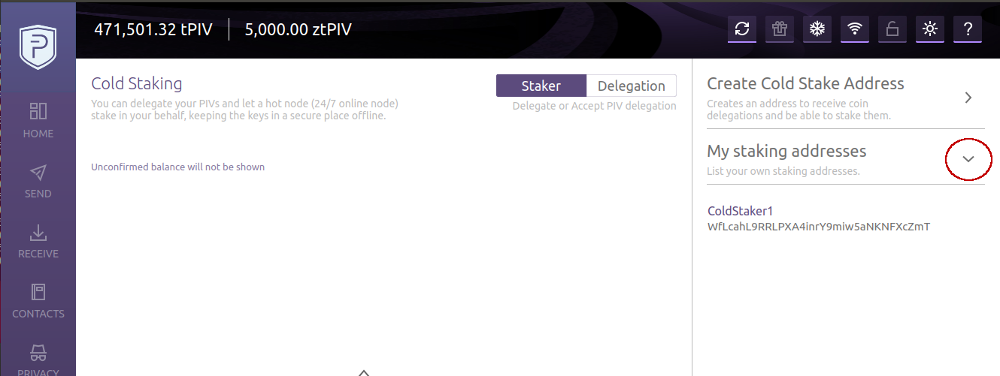

<br><br>

# PIVX Cold Staking How-To

**Cold staking requires two PIVX wallets: one to hold the funds (this can be also a hardware wallet and does not need to be always online) and another one, the hot-node, to do the staking (this needs to be online 24/7).**

<p>In order to setup cold-staking, you need to perform the following steps:</p>

1) [Generate a "staking address" from the staker wallet](#1) (if you don't have one already).

2) [Generate a "owner address" from the owner wallet](#2) (if you don't have one already).

3) [Create a "cold stake delegation"](#3).

4) [Whitelist the owner address on your staker](#4) (if you haven't already).

5) [Additional RPC functions](#5)

To send more delegations, using the same addresses-pair, just replicate step 3 of this guide.

<br>

### 1) <a name="1"></a>Generate a "staking address" from the staker wallet

Staking addresses must be owned by the __staker__ wallet (the one that is online 24/7 and holds no funds).

*CLI*
>To get a new staking address, from the staker wallet, do:
```
pivx-cli getnewstakingaddress
```
You don't need to create a new staking address for each delegation. You can reuse your previously generated addresses. To list them, do:
```
pivx-cli liststakingaddresses
```

<br>

*GUI*
>to create a staking address, after enabling the cold staking tab (clicking on the topbar icon), select Staker--> "Create cold stake address":<br>
<br><br><br><br>
Insert any amount, a label for the address, optionally a description, and click "Generate":<br>
<br><br><br><br>
The new address gets visualized, along with a QR-code.<br>
You can either copy the address or the URL to paste it during the delegation (see point n.3).<br>
You don't need to create a new staking address for each delegation. You can reuse your previously generated addresses. To viem them click
"My staking addresses":<br>
<br><br>

<br>

### 2) <a name="2"></a>Generate a "owner address" from the owner wallet

Owner addresses are regular PIVX addresses. Their private key can be used to redeem delegated coins. Creating an owner address is aking to creating a receiving address.
They must belong to the __owner__ wallet (the one that is offline and has the ownership of the coins). The owner wallet can also be a hardware wallet device or a paper wallet.

*CLI*
>To get a new owner address, from the owner wallet do:
```
pivx-cli getnewaddress
```

<br>

*GUI*
>To get a new owner address, simply go to the "Receive" tab and click "Generate address":<br>
<br><br>

You don't need to create a new owner address for each delegation. You can reuse your previously generated addresses.

<br>

### 3) <a name="3"></a>Create a "cold stake delegation"

This is the main step.<br>
To delegate coins you need to send a special "delegation contract" transaction.

*CLI*
>Specify the staker address, the amount to delegate and (optionally) the owner address:
```
pivx-cli delegatestake "S1t2a3kab9c8c71VA78xxxy4MxZg6vgeS6" 1000 "DMJRSsuU9zfyrvxVaAEFQqK4MxZg34fk"
```
If the owner address is omitted, a new address is automatically generated from the wallet.<br>
If you want to delegate to an *external address* (using an owner address not present in the wallet, e.g. one from a hardware device), then you need to add `true` at the end of the command (check `pivx-cli help delegatestake` for more info).

<br>

*GUI*
>From the coldstaking widget, click "delegation".<br>
As with the regular sending operation, you must select an amount and either let the wallet pick the coins, or select them with coin control.
<br>
Insert the staker address (or select it from the list of previously used ones), a description, and (optionally) a owner address (again, if not provided, it will be generated automatically).<br>
Then click "Delegate".<br>
<br><br>

<br>

### 4) <a name="4"></a>Whitelist the owner address on your staker

In order to stake delegations, the owner address must be whitelisted by the staker.

*CLI*
>To whitelist an address (`<owneraddress>`), from the staker wallet do:
```
pivx-cli delegatoradd <ownerAddress>
```
Once a delegator address is whitelisted, it remains so, even for successive delegations.<br>
To remove a particular address from the whitelist, do
```
pivx-cli delegatorremove <ownerAddress>
```
To view the current whitelisted addresses, do
```
pivx-cli listdelegators
```

<br>

*GUI*

>The delegation is visible in the "Staker" tab of the coldstaking widget:
<br>
To whitelist the delegator, click on its row and select "Stake" from the contextual menu
<br>
To remove the delegator from the whitelist, select "Stop staking" from the contextual menu:
<br>

<br>

### 5) <a name="5"></a>Additional RPC functions

These are other JSON-RPC calls accessible via console or `pivx-cli`.<br>
Check the help for more info on each one.<br>
- `getcoldstakingbalance`
- `getdelegatedbalance`
- `listcoldutxos`

<br>
